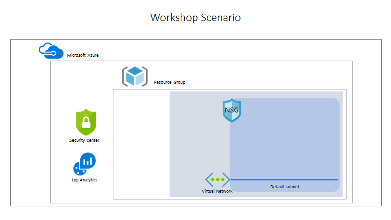
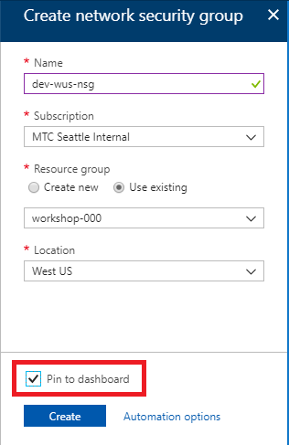
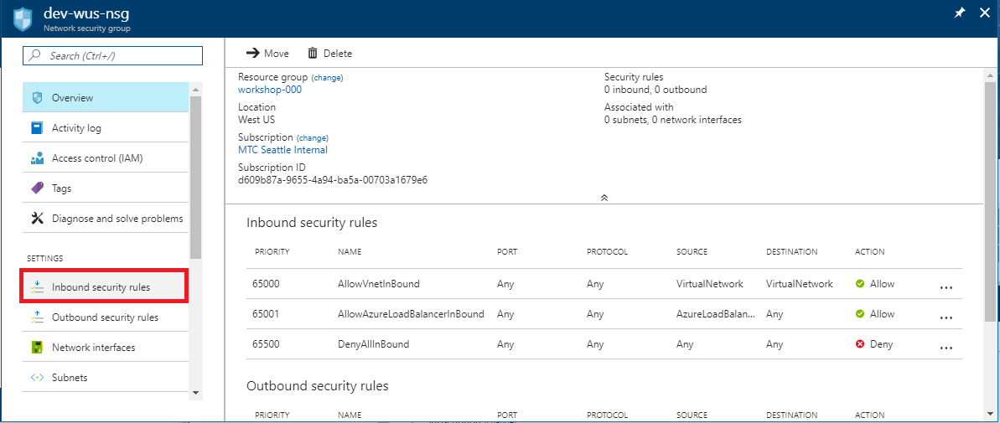
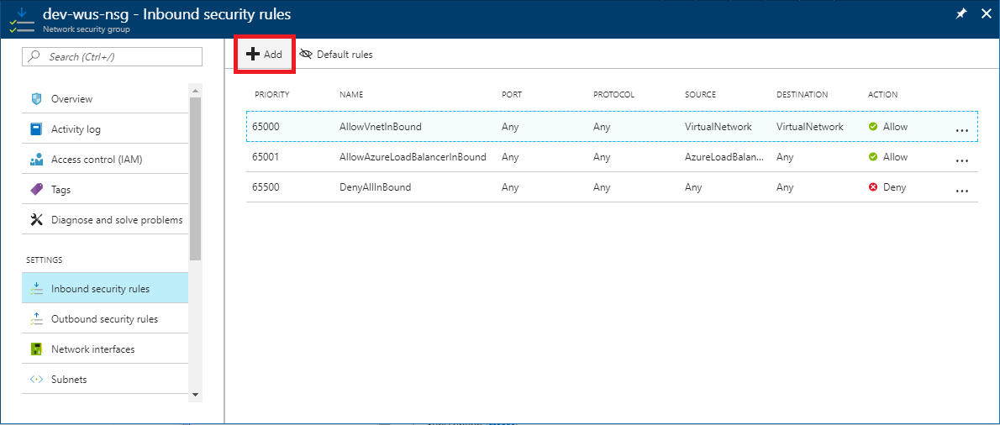
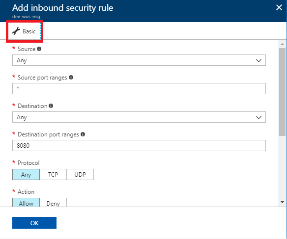
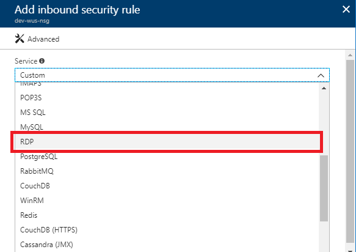
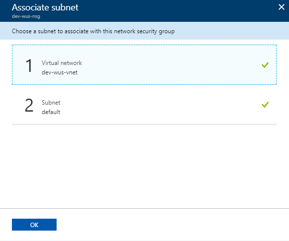
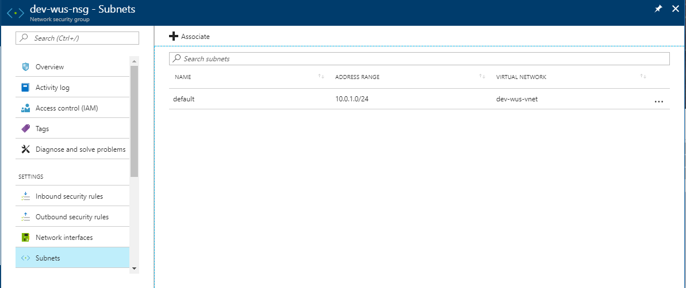

# 3. Create Network Security Group

Create a Network Security Group and assign the NSG to the subnet in your Virtual Network.

## Architecture

## Create Network Security Group

1. Click '+ New' and search Network Security Group.

    Click 'Create' button.

    

1. Name to your new Network Security Group and create.

    Type name and select your resource group. And please check 'Pin to dashboard'.

    |Name|Subscription|Resource Group|Location|
    |---|---|---|---|
    |dev-wus-nsg|*yoursubscription*|workshop-###|*West US*|

    

## Add Inbound Security Rules

1. Click Netowkr Security Group.

    

1. Click 'Inbound Security rules' to add new rule.

    

1. Click 'Add'.

    

1. Click 'Basic'.

    

1. Select 'RDP' from the Service list.

    

1. Click 'OK'.

    

1. One update is done, you'll see port 3389 TCP is added as RDP on the inbound security rule.

    

## Apply the rules to subnet

1. Open your Network Security Group.

    

1. Click 'Subnets' and then click '+ Associate'.

    

1. Click '1.Virtual Network' and then choose your virtual network.

    

1. Choose 'Default' subnet.

    

1. Confirm your selected options and click 'OK' to continue.

    

1. Once update is done, you'll see the subnet on the associated list.

    
---

[>> NEXT](https://github.com/xlegend1024/az-secu-wrkshp/tree/master/4.CreateKeyVault/Readme.md)
